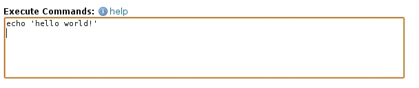

# How to make a hello world job

# Hello world

To make the standard "hello world" print out on grid.dk we will use the <a href="https://portal.grid.dk/cgi-bin/submitjob.py">submit job page</a> on the web interface. We simply use the resource's bash command echo. Each line in the field **Execute commands** will be executed on a grid.dk resource so we simply write:

```
echo 'hello world!'
```

In the <a href="https://portal.grid.dk/cgi-bin/submitjob.py"> submit job web user interface</a> it would like this.



Then click "submit job". 


## User script

If you are submitting the job from the MiG command-line user scripts or API, you will need to create an .mRSL file. For the "hello world" job it should look like this:

```
::EXECUTE::
echo 'hello world!'
```
