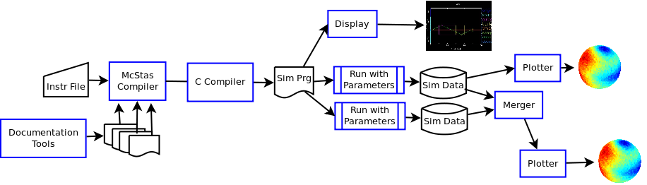

# !McStas Neutron Raytracing Example

# Neutron ray-tracing with !McStas

In the following Grid usage example, we will use a software
[McStas](http://www.mcstas.org) which simulates experiments with
accelerated neutrons.

## Background

The following picture illustrates parts, features and possible
workflows of using the !McStas software.



Depicted on the left is an *instrument* file. It specifies the
setup of a number of physical *components* that influence a
neutron beam in three-dimensional space. Components can be
predefined in a library that comes with !McStas, or programmed
individually as additional input files (not shown). The
instrument setup should contain a neutron source, a number of
*detectors* which will later collect data from the experiment, a
sample which scatters the neutrons, and possibly a number of
other components to influence the neutron beam in various ways.

In the first step, the !McStas compiler processes this input
instrument and produces a simulation program in C.
This simulation program can be used to display the instrument
setup with an additional tool (upper branch), but its main
purpose is of course to produce detector data for an actual
experiment simulation (lower branch).
Being a standard C program, the generated simulation code can be
compiled using a standard C compiler for a range of platforms.

Depending on how the instrument is specified, some component
parameters of the instrument need to be specified for every
simulation run. 
This enables to run parameter sweeps (variation of one parameter
within a certain allowed range), and each of the possible
parameter values defines a separate grid job.

Or, a simulation can be parallelised into several jobs (using the
same parameters) and the data is merged using a separate !McStas
tool. Finally, each detector's collected data will be plotted
into a spectrogram or histogram.

## Grid Job Workflow

In a Grid environment, installing special software such as the
!McStas tools is often problematic. The availability of such
software, and what exactly is provided, is captured by the
definition of a [[Runtime Environments|Runtime Environment]].

For the middleware MiG used in grid.dk, runtime environments are realised 
by means of environment variables, to be used in job scripts.
For our case of !McStas, the environment **MCSTAS-TOOLS** defines four variables:

<table>
  <tr><td>Variable</td><td>Meaning</td><td>used by</td></tr>
  <tr><td>MCSTAS</td><td>base path of !McStas installation</td><td>all !McStas scripts, for access to the library</td></tr>
  <tr><td>MCSTAS_C</td><td>full path to !McStas compiler</td><td>user, to compile</td></tr>
  <tr><td>MCDISPLAY</td><td>full path to !McStas display tool</td><td>user, to display instrument setup</td></tr>
  <tr><td>MCPLOT</td><td>full path to !McStas result plotter</td><td>user, to plot data</td></tr>
</table>

Users can thus access the !McStas library and call the compiler, the plotter,
and the display tool, using these variable names in the execution script.

### Compilation of a simulation program

In the first step, the instrument file is compiled using a resource 
which provides the necessary !McStas tool installation.
We assume that we have an instrument file, example.instr.
The following shell script should be executed on the resource:

```
::EXECUTE::
$MCSTAS_C -o example.c example.instr
cc -lm  -O3 example.c -o example.out
./example.out --help >& example.txt 
```

We transfer the instrument file *example.instr* to the resource
as an input file, and transfer *example.c* and *example.txt* back
to the user home in the Grid server file system. It is convenient 
to use a special directory for this output:

```
::INPUTFILES::
example.instr

::OUTPUTFILES::
example.c instruments/example.c
example.txt instruments/example.txt
```

The generated program example.out is platform-dependent and
should not be used unconditionally. We have compiled it as
a test whether our instrument was correctly translated, and 
in order to obtain usage information in the generated text 
file. 

### Running simulations

It is now very easy to run one or more simulations in parallel,
on any grid resource which provides a C compiler. 

The job needs to supply the C program as an input file, and
creates an archive of the simulation output (which is placed in a
directory named after the job ID).

The following commands will be executed:

```
cc -O3 -lm -o example.out example.c
./example.out -d +JOBID+.output PARAM1=value1 PARAM2=value2 ...
tar czf +JOBID+.output.tgz +JOBID+.output
```

Please note that all instrument parameters have to be given on
the command line, as shown here. Even if there are defaults,
McStas simulation programs do not provide any option to use them
without interaction.

With the *-d* option, Simulation data will be placed in a
subordinate directory, named after the Job ID with the keyword
`+JOBID+`. When the simulation is finished, this directory is
archived and transferred back to the server, into a result
directory.

```
::OUTPUTFILES::
+JOBID+.output.tgz simulations/+JOBID+.output.tgz
```

### Generating graphics from results

Plotting simulation data (in postscript or gif format) again
requires a !McStas installation, specified by the runtime
environment *MCSTAS-TOOLS*.
Input data can be one archive produced by a simulation run in the
previous step.

```
::EXECUTE::
tar xzf **.output.tgz
mv **.output/ data/
$MCPLOT -psc data/mcstas.sim

::OUTPUTFILES::
data/mcstas.sim.ps simulations/+JOBID+.ps

::INPUTFILES::
simulations/123_45..output.tgz
```

(The "123_45.." in the last line of this mRSL fragment should of course be
replaced by a valid filename).

<!---
This will be left out from the wiki page, but noted in its source code...

Merging data from several similar runs and generating views for
the total is not much more complicated. We need to add a step
which merges the different runs, using the tool
`mcformat` (in `/usr/local/bin` or in a custom location besides the
other tools, depending on where !McStas had been installed).
See the !McStas manual for details on its usage.

```
TMP=`which $MCSTAS` MPATH=`dirname $TMP` \
  $MPATH/mcformat --merge --force -d data 
echo THIS DOZNWOK NICELY! (directory naming issue)
```
--->

The final result of the experiment is now a coloured postscript file that
shows all detector data in an overview.


