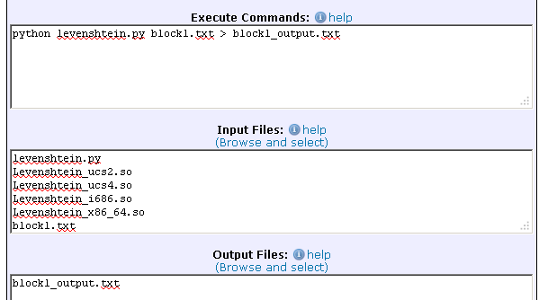

# Library reference match

<!-- No auto-Table of Contents support! -->

# Introduction

In the field of library and information science research, it is of interest to find the number of times an academic paper has been referenced in other scientific publications. This is done by extracting the bibliographical references from a set of publications and then counting the number of times each reference occurs. Because the data set in question approximates 12 million lines of reference strings, it is too large to be executed on an average workstation. It is suited for grid computing because we can partition the workload into several jobs and execute them in parallel.


# Files of this example

All the files used in this example are available in [this archive](code_examples/refmatch/refmatch.zip).

# Reference matching on grid.dk

This section provides a use case tutorial on how to perform reference matching on grid.dk. As we explain the steps, you can learn basic concepts of designing a simple grid application. You can then apply the technique to your own computational problem. 

One of the central concepts of grid computing is that a large amount of resources can be aggregated through a network connection to form a computationally powerful entity. Each resource is a computer host, that can execute its own job. If a computationally hard problem requires a massive amount of calculations, we can then utilize the grid resources and make several computers work on the same problem in parallel, efficiently reducing the total execution time considerably. 

## Reference string matching

As explained, we want to find out how many times a paper is cited by counting the number of times it appears in other papers. This is done by "fuzzy" matching each reference string to all others. The technique is called the Levenshtein edit distance. It has the advantage that it calculates an edit distance rating that defines how well the strings match. This is necessary because the same reference entry may be typed differently from paper to paper.

The program is run via command line by typing
```
python levenshtein.py ref1000.txt > output.txt
```

The application is in the `levenshtein.py` [file](code_examples/refmatch/levenshtein.py). The references we want to match are in the file [`ref1000.txt`](code_examples/refmatch/ref1000.txt). The results are redirected to the file `output.txt`.

## Creating a grid application

At this point, we have a Levenshtein matching application which runs on a single computer. We need to turn this into a grid application. This is done by fragmenting the workload into several smaller jobs. However, we still use the same basic program. We can take advantage of a technique called blocking, which is often used in this field to reduce the large workload into smaller blocks. We thus take the original references file, sort the references and create a number of block files that each contain a subset of the references. Each job can then process its own block independently. 


## Configuring a grid.dk job

We'll now create a job that runs on grid.dk. The command we want to execute in the grid.dk job is like the one we wrote previously, only we use a block as input instead of the whole file:
```
python levenshtein.py block1.txt > block1_output.txt
```

The input files for the job are [`levenshtein.py`](code_examples/refmatch/levenshtein.py") containing the python code, and [`block1.txt`](code_examples/refmatch/block1.txt) with the references. To increase performance we also use an external Levenshtein edit distance function from the Levenshtein  shared C library file. It is imported dynamically during execution so we specify it as an input file too. In fact, we specify specify several library files. These are the same library, but compiled for different platforms. This way, our job can run on several different platforms. The output file is `block1_output.txt`.

To be sure Python is available, we should in principle specify that we need a Python runtime environment and use the alias `$PYTHON` instead of `python`. However, loading the shared native .so libraries from a non-system Python appears not to work reliably and therefore we don't specify any runtime environment and just rely on the fact that Python is in fact installed on all resources.

Before actually running the job, we first upload the input files using the <a href="https://portal.grid.dk/cgi-bin/fileman.py">file manager</a>. 

Finally, we submit the job with the [grid.dk web portal](https://portal.grid.dk/cgi-bin/submitjob.py?template_path=../job_templates/refmatch.mRSL).



## Running multiple jobs

When submitting multiple jobs it is not really convenient to use the web page for every job. In such cases, one possibility is to use the MiG API provided by the [miglib.py module](code_examples/refmatch/miglib.py).

The script [`grid_levenshtein.py`](code_examples/refmatch/grid_levenshtein.py) generates and submits 5 job descriptions. It's executed from the local command line with: 
```
python grid_levenshtein.py
```

## Job monitoring

After submitting the jobs, we can follow their progress on the grid.dk <a href="https://portal.grid.dk/cgi-bin/jobman.py">job monitor</a>. Below, the five new jobs are in "QUEUED" status, waiting for available resources.


## Retrieving output

When the job monitor shows a "FINISHED" job status, the results are available on the grid.dk server. To retrieve our output file, we can right-click and choose "Output Files":


This will open the directory containing the output file in the file manager. To download the file to local disk we right-click again and choose "Download":

