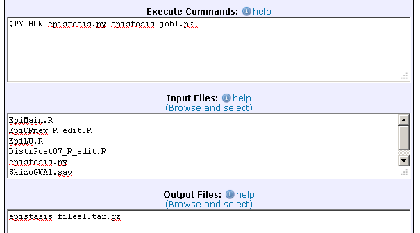
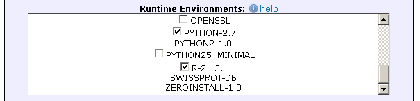
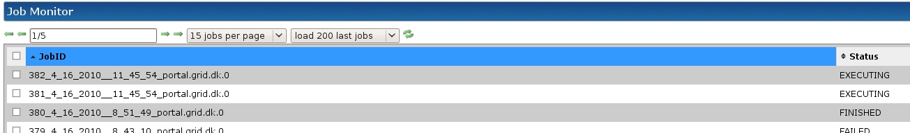
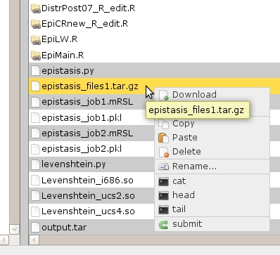

# Use case example of epistasis job using R

<!-- No auto-Table of Contents support! -->

# Introduction

In genome research, epistasis is the occurrence of one gene modifying the effects of another gene. Researchers try to identify networks of genes that affect one another and combine to cause various physiological traits. This is particularly relevant in identifying genetically inherited deceases such as diabetes or skizofrenia. Gene networks can be found by statistically analyzing gene combinations, comparing them to a list of traits in order to find a link between a group of genes and a set of physiological traits. Because of the massive amount of gene combinations, the computational burden of this procedure is simply too large to be executed on a single computer in reasonable time. It is therefore well-suited for grid execution.

</img>

# Files of this example

Files used in this example are available [here](code_examples/epistasis/epistasis.zip).

# Epistasis on grid.dk

The basic concept of creating a grid application is to fragment the workload into several independent job. Each job is executed on a grid resource and afterwards the results are accumulated. By parallelizing execution onto several nodes we can obtain a substantial performance boost when dealing with a large computational burden. 


## Epistasis program

The code for the epistasis procedure is written in the open-source statistical computing language R residing in a set of .R files. Because we need to load several files before we can start execution it is convenient to write a batch script so we can run the epistasis process in its entirety without interaction. The python script [epistasis.py](code_examples/epistasis/epistasis.py) functions as a wrapper that loads the .R files and executes the epistasis program. We do not know in advance how many files will be produced so to keep track we gather all the output files in an archive called `epistasis_files.tar.gz`. This is done from within our python script. The epistasis program is executed using the command

```
python epistasis.py job_file.pkl
```

For this to run, Python and R must be installed.

## Configuring a grid.dk job

To run a single epistasis job on grid.dk, you must first upload the  python script `epistasis.py` along with the dataset file `SkizoGWA1.sav`, the .R files and a job settings file in python's pickle format to your folder on the portal. This you can do with the <a href="https://portal.grid.dk/cgi-bin/fileman.py">file manager</a>. Then, you can use the <a href="https://portal.grid.dk/cgi-bin/submitjob.py?template_path=../job_templates/epistasis.mRSL">job submission pane on the portal</a> to submit the job.



We need to specify that we want R and Python in the runtime environment.



## Running multiple jobs

Single jobs are conveniently submitted from the web portal. However, to run multiple jobs, it is usually faster to use scripting. The script `grid_epistasis.py` uses the MiG API to upload input files to the server, generate a number of job description files and submit them.

A MiG job description (.mrsl) file contains the information needed by the grid.dk server to run a job - the same information we typed into the web interface above. The job description file corresponding to the fields above can be seen [here](code_examples/epistasis/example.mRSL).

`grid_epistasis.py` sweeps over a range of values of a certain column of the data matrix. For each value it creates an input file, `job_fileN.pkl`, as well as a job description file. Since this is just an example, the sweep is only over two values.

## Monitoring

When the jobs have been submitted, we can use the grid.dk <a href="https://portal.grid.dk/cgi-bin/jobman.py">Job Monitor</a> to follow their progress. 



## Results

At some point the jobs will terminate and go into the "Finished" status. Now we can use the <a href="https://portal.grid.dk/cgi-bin/fileman.py">file Manager </a> to download output file.

